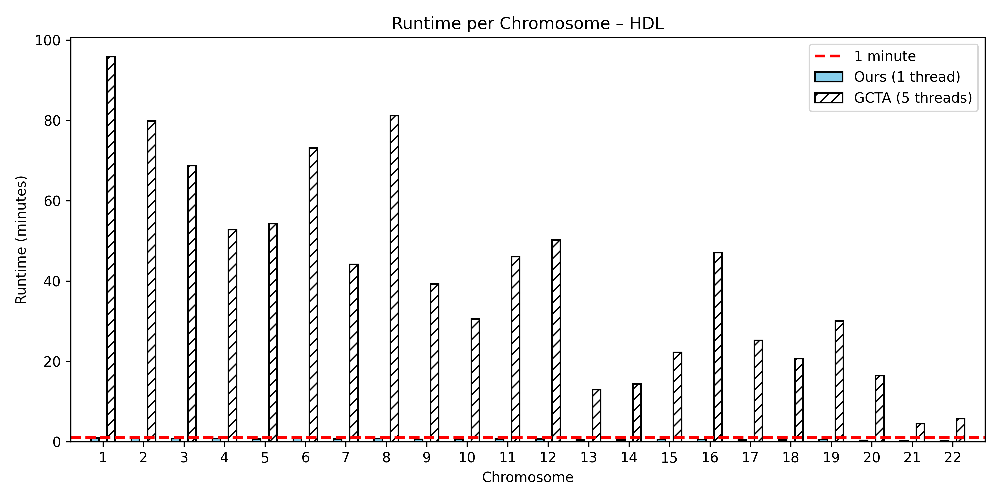

**Manc-COJO** is a tool for multi-ancestry conditional and joint analysis (COJO) of GWAS summary statistics. [TBD by Mark]

{: .highlight }
Note that our program can also perform single-ancestry COJO and reproduce the result of [original GCTA COJO], but runs much faster.

For example, for HDL trait on ~6.5 million SNPs and ~76,000 individuals, the running time per chromosome for our program using 1 thread, and GCTA using 5 threads, is as follows. 

--- 

If you find our paper or software useful for your research, please consider citing our paper (citation to be added).

--- 

Please contact Yong (yong.wang@stats.ox.ac.uk) for software-related enquries and bug reports, or Mark (xiaotong.wang@psych.ox.ac.uk) for algorithm-related questions. We also welcome GitHub issues, including usage feedback and new feature requests, so that discussions are visible to all users.

[original GCTA COJO]: https://yanglab.westlake.edu.cn/software/gcta/#COJO
